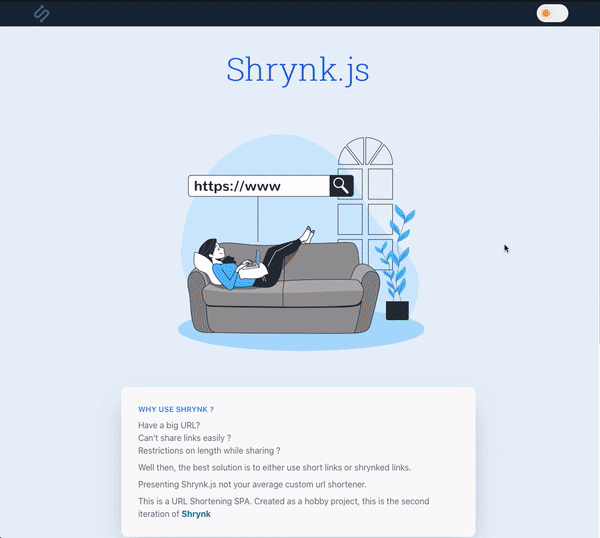
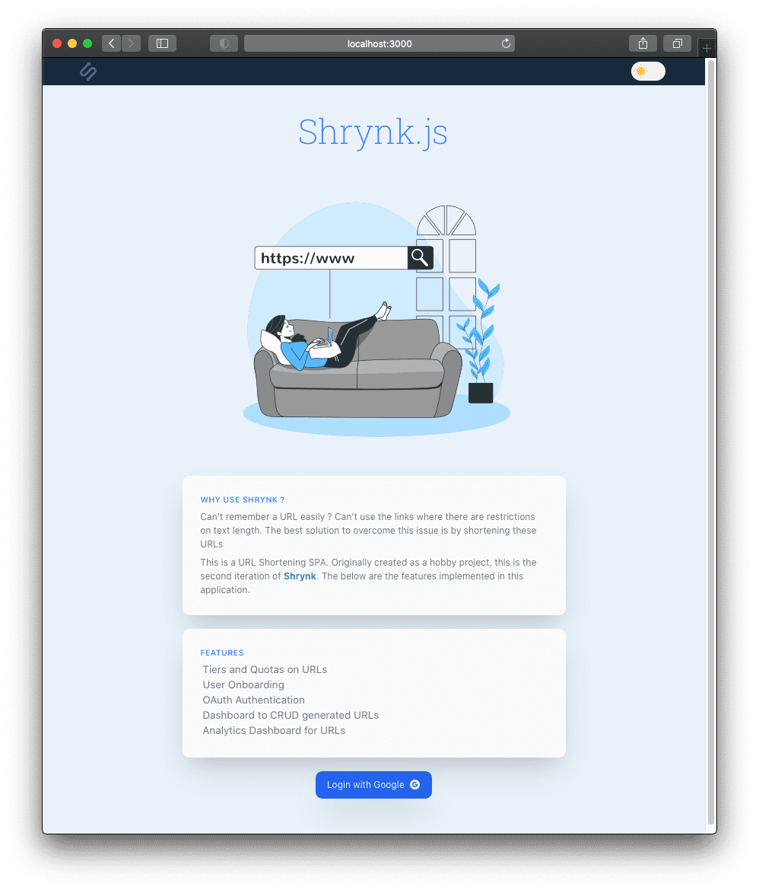
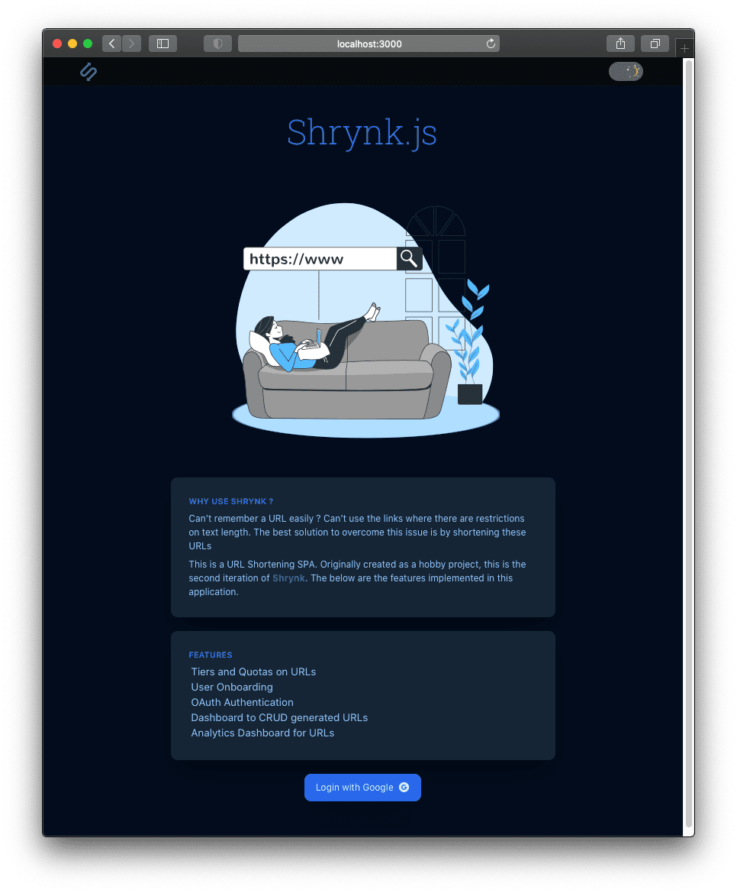

<h1 align="center">
  Shrynk.js
</h1>

<h3 align="center">A product rather than a project.</h3>

<div align="center">
  <sub>Built with ❤︎ </sub>
</div>

<h2 align="center">
  Introduction
</h2>

Shrynk.js is a url shortening single page application, a product rather than a project similar to bit.ly, tiny.url, etc where users can create and manage multiple URLs. 

[Demo-Video](https://youtu.be/vYQKlfq_2h0)

<h2 align="center">
  How did I make it unique ? Features ?
</h2>
Added,

- OAuth Authentication
- User Onboarding
- Tiers and Quotas on Users
- Dashboard to Create, Read & Delete generated URLs
- Link Analytics Dashboard

<h2 align="center">
 What else ?
</h2>

- Implemented API security measures, rate-Limiting, validation.   
- URLs have an expiry date, if accessed after, appropriate error message is shown and URL is removed from system. 
- App features Dark Mode, Mobile UI, Toast messages.

<h2 align="center">
 How did I build it ?
</h2>

Tech Stack,

- Client: React (Router, Context-API, Hooks, Lazy & Suspense), TailwindCSS, Custom CSS
- Server: Express.js/Node.js written in Typescript.
- Database: MongoDB Atlas (Cloud DB)
- Deployment: AWS EC2 (Ubuntu Instance), Route53, NGINX (Reverse Proxy), PM2 for Node.js

<p align="center">
  
  
  
  
  
  
  
  
  
</p>

<h2 align="center">
 Writeups
</h2>

- [Personal Blog Post](https://blog.jagankaartik.com/posts/nodejs-aws-indepth-guide/)
- [Medium Article](https://medium.com/@kaartikjagan/an-in-depth-guide-to-deploying-your-node-js-application-to-production-using-aws-with-custom-domain-1fe3b0638a75)

<!-- <h2 align="center">
 Self-Hosting Steps
</h2>

### Installation 

#### Prerequisites

- Node.js/NPM
```
curl -fsSL https://deb.nodesource.com/setup_16.x | sudo -E bash -
```
```
sudo apt-get install -y nodejs
```

- Enviornment Variables

You'll need to create two env var files `(.env)`, one in server's root `(server/)` and the other in client's root `(app/)` and populate them appropriately.

In Server,
```
PORT=""
MONGO_URL=""
COOKIE_KEY=""
GOOGLE_CLIENT_ID=""
GOOGLE_CLIENT_SECRET=""
GITHUB_CLIENT_ID=""
GITHUB_CLIENT_SECRET=""
NODE_ENV=""
CLIENT_URL_PROD=""
CLIENT_URL_DEV=""
JWT_SECRET=""
```
In client(app),
```
REACT_APP_API_URL_PROD=""
REACT_APP_API_URL_DEV=""
REACT_APP_GA_ID=""
```
### Installation 

- `cd` into root of the repository. Run `make install`, this will install all the dependencies in client's and server's package.json

```
make install
```
- Running 'make build' will build the react-client & typescript-express server.
```
make build
```
#### Running Dev
```
make run-dev
```
#### Running Production locally
```
make run-prod
```
 -->
<h2 align="center">
 Preview
</h2>

<p align="center">
  
  
</p>

<h2 align="center">
 UI Screens
</h2>

<p>
  
   
</p>

<a href="https://storyset.com/web">Illustration by Freepik Storyset</a>

